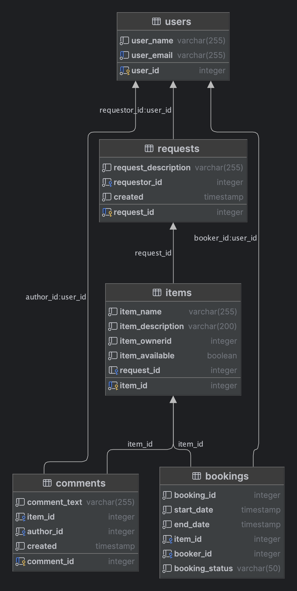

# Share It - сервис для шеринга вещей

---

## Описание

Share It позволяет брать или сдавать в аренду любую бытовую вещь - от молотка до холодильника.
Если какой-то вещи еще нет в сервисе, вы можете оставить на него заявку для других пользователей.

---

## Функциональность

Приложение включает в себя два сервиса:

* **Сервис валидации входных запросов** (shareit-gateway) отвечает за проверку запросов на входе на корректность данных
* **Основной сервис** (shareit-service) включает в себя основной функционал работы приложения

### Возможности сервиса валидации:

- Проверка на отсутствие требуемых данных
- Проверка формата и корректности даты/времени начала и окончания брони

### Возможности основного сервиса:

- Добавление, обновление и удаление пользователей
- Добавление, обновление и удаление данных о вещи
- Поиск вещи по имени или описанию
- Добавление комментариев к вещам
- Возможность добавить добавления и обновления данных о бронировании вещи
- Получение списка всех бронирований текущего пользователя
- Получение списка бронирований для всех вещей текущего пользователя
- Получение данных о конкретном бронировании (включая его статус)
- Добавление запросов на вещи
- Получение данных о конкретном запросе
- Получение списка запросов пользователя вместе с данными об ответах на них.
- Получение списка запросов, созданных другими пользователями для определенной вещи

---

## ER-диаграмма базы данных:



---

## Технологический стек

Проект использует следующий набор технологий, библиотек и инструментов:

- **[Spring Boot](https://spring.io/projects/spring-boot)**

- **[Docker](https://www.docker.com/)**

- **[Lombok](https://projectlombok.org/)**

- **[QueryDSL](http://www.querydsl.com/)**

- **[PostgreSQL](https://www.postgresql.org/)**

- **[Spring JPA](https://spring.io/projects/spring-data-jpa)**

- **[Hibernate](https://hibernate.org/)**

- **[IntelliJ IDEA](https://www.jetbrains.com/idea/)**

---

## Установка и запуск

Для того чтобы запустить проект у себя локально, необходимо выполнить следующие шаги:

### Предварительные требования

Убедитесь, что на вашем компьютере установлены следующие инструменты:

- Java JDK 11 или выше: [Скачать](https://www.oracle.com/java/technologies/javase-jdk11-downloads.html)
- Docker: [Инструкция по установке](https://docs.docker.com/get-docker/)
- IntelliJ IDEA (для разработки): [Скачать](https://www.jetbrains.com/idea/download/)

### Установка проекта

1. Клонируйте репозиторий проекта:

```
git clone https://https://github.com/DmitryMisevra/java-shareit.git
cd java-shareit
```

2. Запустите все сервисы одной командой с использованием Docker Compose:

```
docker-compose up --build
```

Эта команда сначала соберет образы для сервисов, указанных в файле docker-compose.yml, если они еще не собраны,
и затем запустит контейнеры. Флаг --build гарантирует, что будут использованы самые последние версии образов.

После успешного запуска контейнеров приложение будет доступно по следующим адресам:

* Сервис валидации: http://localhost:8080
* Основной сервис: http://localhost:9090

База данных доступна на порту 6541.
